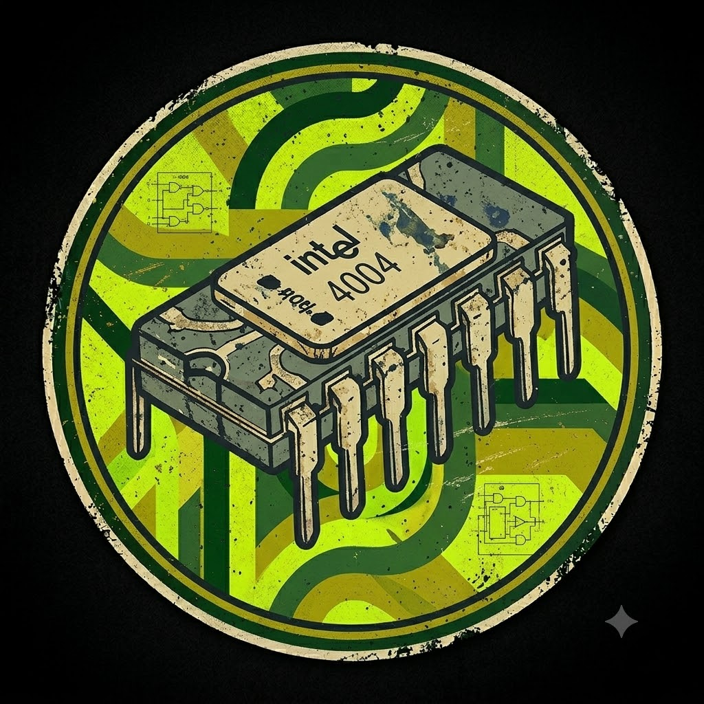

# ⛧ infernal-init



> LowCache, High Throughput

`infernal-init` is a high-performance shell initiation banner written in Nim. Unlike traditional "fetch" tools, it is designed as the graphical manifestation of a new terminal session, providing immediate branding, high-impact ASCII art, and essential system telemetry.

## ⚡ Features

- **Dissected ASCII Architecture**: Dynamically injects branding banners into complex ASCII art blocks.
- **TrueColor Support**: Utilizes specific TrueColor palettes extracted from custom artwork.
- **Lightweight & Fast**: Compiled Nim binary with zero runtime dependencies.
- **Nix-Native**: Fully Flake-enabled for seamless integration into NixOS configurations.
- **Robust Telemetry**: Graceful fallbacks for system info (OS, Kernel, Uptime, Shell).

## 🚀 Quick Start

Run it immediately without installing:

```bash
nix run github:lowcache/infernal-init
```

## 🛠️ Installation (NixOS Flake)

1. Add it to your `flake.nix` inputs:

```nix
inputs.infernal-init.url = "github:lowcache/infernal-init";
```

2. Add the package to your `home-manager` or system packages:

```nix
environment.systemPackages = [
  inputs.infernal-init.packages.${system}.default
];
```

3. Trigger it in your shell configuration (e.g., `fish`):

```fish
if status is-interactive
    infernalinit
end
```

## 🎨 Configuration

The tool embeds assets at compile-time for maximum speed. To customize the ASCII art or tagline, modify `assets/lowcacheascii` and `src/infernalinit.nim` respectively, then rebuild the derivation.

---
*lowcache 2026*
