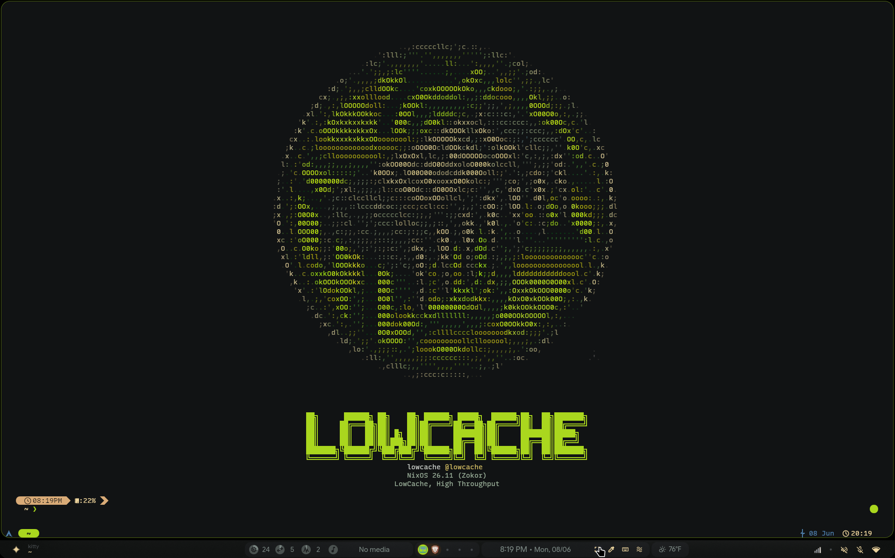

# ⛧ volinit



> LowCache, High Throughput

`volinit` is a terminal session identity engine written in Nim. Unlike traditional
"fetch" tools, the ASCII art is the product: it renders a branded chip badge, adapts
its layout to the terminal, and keeps telemetry deliberately minimal. Single binary,
~3 ms startup, no runtime dependencies.

## ⚡ Features

- **Responsive layouts**: split-panel (≥160 cols), hero (100–159), compact (60–99),
  monogram (<60) — selected automatically, art degrades gracefully when it doesn't fit.
- **TrueColor themes**: `chip-green` (default), `synthwave`, `mono`, plus user theme
  packs with their own art and palettes.
- **Runtime config**: optional config file, env vars, and CLI flags — with compiled-in
  defaults, so no config means the classic output.
- **Silent probes**: OS, user, git branch (direct `.git/HEAD` parse, no subprocess),
  battery — every probe falls back cleanly, nothing ever crashes the banner.
- **Pipe-safe**: `volinit | cat` emits plain `key: value` text, no escape codes.
- **Export & generate**: render the banner to ANSI/SVG files; build theme packs from
  any image via `jp2a`/`chafa`/`img2txt`.
- **Nix-native**: fully Flake-enabled.

## 🚀 Quick Start

```bash
nix run github:lowcache/volinit
```

## 🛠️ Installation (NixOS Flake)

1. Add it to your `flake.nix` inputs:

```nix
inputs.volinit.url = "github:lowcache/volinit";
```

2. Add the package to your `home-manager` or system packages:

```nix
environment.systemPackages = [
  inputs.volinit.packages.${system}.default
];
```

3. Trigger it from your shell init:

```bash
# Bash / Zsh — ~/.bashrc or ~/.zshrc
if [[ $- == *i* ]]; then volinit; fi
```

```fish
# Fish — ~/.config/fish/config.fish
if status is-interactive; volinit; end
```

```nu
# Nushell — $nu.config-path
if (is-terminal --stdout) { volinit }
```

```sh
# POSIX sh — ~/.profile
case $- in *i*) volinit ;; esac
```

## 🧰 Usage

```
volinit [options]
  --mode=MODE      auto | split-panel | hero | compact | monogram
  --theme=THEME    built-in or user theme pack name
  --animate        scanline reveal (auto-disabled in tmux/screen/pipes)
  --demo           render every mode × theme combination
  --list-themes    list built-in and user themes
  --version / --help

volinit export --format <ansi|svg> [--output PATH] [--theme=NAME]
volinit generate --from-image PATH [--output NAME]
```

## 🎨 Configuration

Configuration is optional — with no config file and no flags the output is identical
to the classic compiled-in banner. Precedence (highest wins):

1. CLI flags
2. Environment: `VOLINIT_MODE`, `VOLINIT_THEME`, `VOLINIT_ANIMATE`
3. `~/.config/volinit/config.toml` (user)
4. `/etc/volinit/config.toml` (system)
5. Compiled defaults

```toml
# ~/.config/volinit/config.toml
# Note: parsed with Nim's std/parsecfg — INI-style [section] key = "value".
# Simple keys as shown work; full TOML (arrays, nested tables) is not supported.

[display]
mode = "auto"          # auto | split-panel | hero | compact | monogram
theme = "chip-green"   # chip-green | synthwave | mono | <user pack>
animate = false

[identity]
handle = "@lowcache"
tagline = "LowCache, High Throughput"
wordmark = "LowCache"  # shown when the terminal is too narrow for art/figlet
user = ""              # empty = auto-detect

[metadata]
show_os = true
show_git = false       # parses .git/HEAD of the cwd, no subprocess
show_battery = false
```

Malformed or missing config files fall through to defaults — the banner never fails
to render.

### Theme packs

User themes live in `~/.config/volinit/themes/<name>/` with a `pack.toml`,
`palette.toml`, and optional `art/{hero,compact,monogram}.txt`. Built-in theme names
cannot be shadowed by user packs. See [THEMES.md](THEMES.md) for the format and
[CONTRIBUTING.md](CONTRIBUTING.md) to submit one. Generate a pack from any image:

```bash
volinit generate --from-image ~/Pictures/logo.png --output my-logo
volinit --theme=my-logo
```

### Built-in art

The default chip badge is embedded at compile time (`assets/lowcacheascii`, 46×92,
plus a 14×28 small render for narrow terminals). Changing the built-in art means
editing those assets and rebuilding the derivation.

---
*lowcache 2026*
